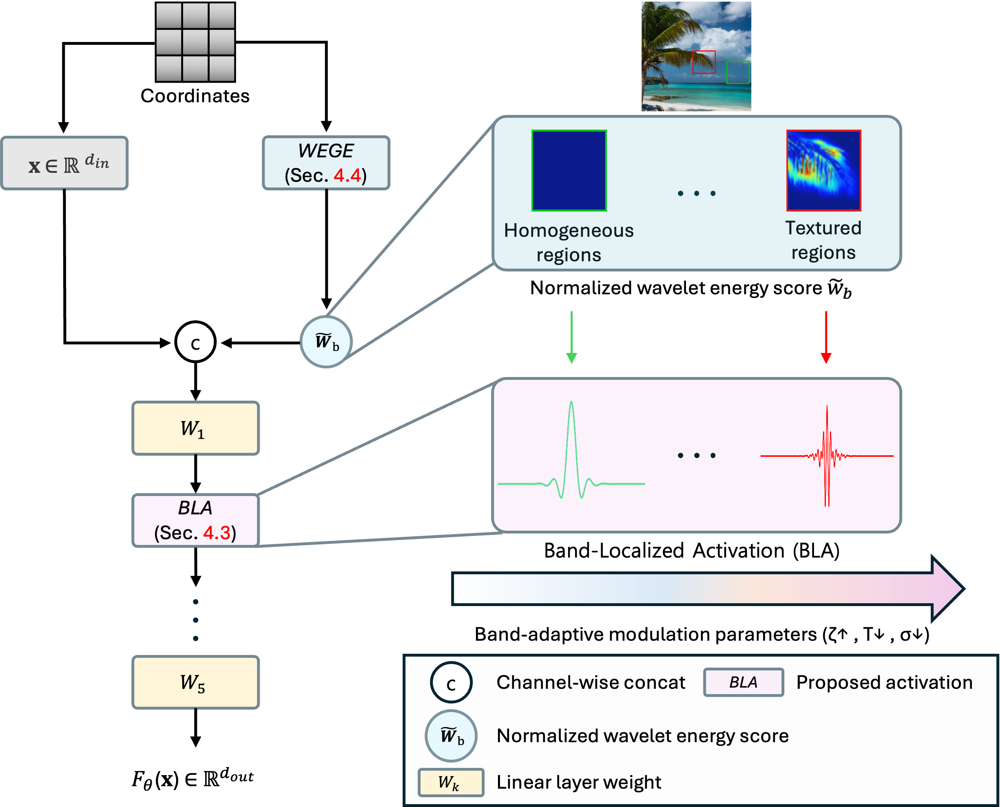

  <h2>✨ FLAIR: Frequency- and Locality-Aware Implicit Neural Representations</h2>

  

    <a href="https://scholar.google.com/citations?user=-VcWf7oAAAAJ&hl=ko" target="_blank">Sukhun Ko</a>1&nbsp;
    <a href="https://scholar.google.com/citations?user=GTWolqAAAAAJ&hl=ko" target="_blank">Seokhyun Yoon</a>1&nbsp;
    <a href="https://scholar.google.com/citations?user=B9OneWIAAAAJ&hl=ko" target="_blank">Dahyeon Kye</a>1&nbsp;
    <a href="https://sites.google.com/view/kylemin" target="_blank">Kyle Min</a>2&nbsp;
    <a href="https://scholar.google.com/citations?user=3feNfdUAAAAJ&hl=ko&oi=sra" target="_blank">Chanho Eom</a>1&nbsp;
    <a href="https://sites.google.com/view/ozbro" target="_blank">Jihyong Oh</a>† 1
  

  

    1Chung-Ang University, South Korea 
    2Oracle, USA
  

  

    †Corresponding author
  

---

  
  
  

---

  <h4>
    Official implementation of  
    <b>"FLAIR: Frequency- and Locality-Aware Implicit Neural Representations"</b>
  </h4>

    
    

        <b>Qualitative comparison.</b> FLAIR achieves faithful reconstruction while mitigating frequency leakage, 
        enabled by the band-limited behavior of BLA. Existing INR models show noise amplification and high-frequency distortion.
    

---

## 📧 News
- **Dec 09, 2025:** This repository is updated.

---

## ✨ Abstract

Implicit Neural Representations (INRs) encode signals by mapping coordinates to values using neural networks, enabling compact and continuous representations. While effective, existing INRs lack mechanisms for frequency selectivity and spatial localization, resulting in redundant feature learning and strong spectral bias—favoring low-frequency components while struggling to represent sharp details.

To address these limitations, we introduce **FLAIR**, a framework integrating two complementary innovations:  
(1) **Band-Localized Activation (BLA)**, a novel activation that enforces learnable band selection and spatial locality under the time-frequency uncertainty principle (TFUP).
(2) **Wavelet-Energy-Guided Encoding (WEGE)**, which leverages discrete wavelet energy to guide frequency signals into the network.

FLAIR consistently improves reconstruction fidelity across 2D image representation, 3D shape modeling, and novel-view synthesis.

---

## ⚙️ Method Overview

    

**Right:** WEGE computes normalized wavelet-energy scores \(\tilde{w}_b\), assigning low weights to homogeneous regions (green) and higher weights to textured regions (red), enabling spatial frequency relevance.  
**Left:** The scores are concatenated with input coordinates and passed into BLA, where learnable parameters \((\zeta, T, \sigma)\) modulate frequency shifting and band-limiting behavior.

---

## 🚀 Code Release Plan

- [ ] 2D representation pipeline  
- [ ] 3D NeRF / SDF integration (built on external implementations)  
- [ ] Ablation studies (NTK, FFT, etc.)  
- [ ] Visualization toolkit  

---

## 📝 Citation

The official BibTeX entry will be updated.

